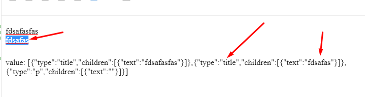

The goal of this repo is to copy the plugins from https://codesandbox.io/s/uhx7mt?file=/App.tsx:920-941&from-sandpack=true until I will have following functionalities
- Forced layout
- Bold
- Italic
- Bullet lists
- urls

This repo does not have the reset content and onchange content, this is playground.
Source from here will be moved to editor with plugins which will be step before ptplate.

Plugins from here will be added to the project productivitytools.learning.plate.editorwithplugins.

